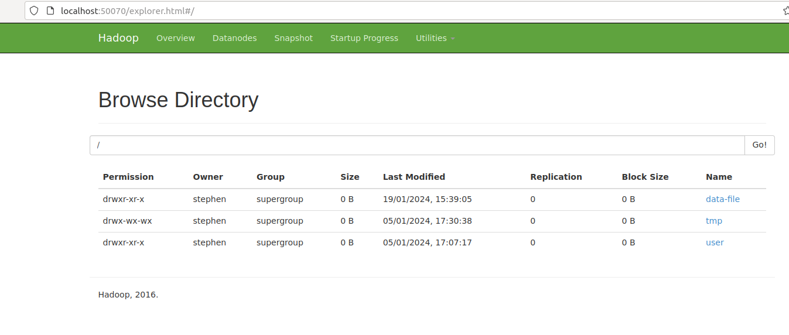
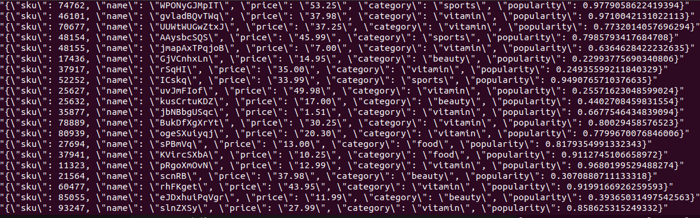
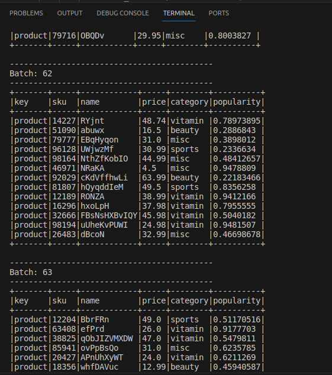
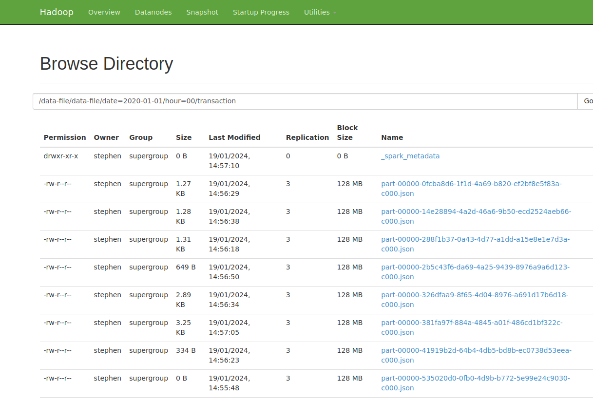

# ETL CHALLENGE

### Technology

1. Storage - Hadoop HDFS
2. Apache Kafka
3. Apache Spark 3.0.1 (spark Streaming)
4. Python 3
5. VSCode

### prerequisite
To run the code successfully, you need to have hdfs setup on either linux server (possibly Ubuntu on Virtual Box). You need to have Kafka installed as well as pyspark setup. Also, ensure your machine has enough memory for the processes involved. If you're using Ubuntu on Virtual Box, try and increase the base memory to about 4gb, though depends on the size of your pc memory.

Ensure all the Deamons of hadoop are printed out when you typed jps on terminal. You should get something like the following - kafka deamons included too.

stephen@Ubuntu-18:~$ jps  
_3249 DataNode_  
_3458 SecondaryNameNode_  
_3045 NameNode_  
_4390 Kafka_  
_3944 NodeManager_  
_3976 QuorumPeerMain_  
_26588 Jps_  
_3612 ResourceManager_

You can interact with hadoop UI through localhost:50070. The UI should look like below.



You can check hadoop path using ```hadoop fs -ls /``` command

Once hadoop is setup, you need to create a topic. This project uses one topic but the topic has for partition.
the dataset baches are consumed by their respective partitions. the partition range from 0 to 3.

**Kafka commands**

|Commands      |Use|
|--------------|---|
|cd $KAFKA_HOME bin/zookeeper-server-start.sh config/zookeeper.properties| Start zookeeper|
|bin/kafka-server-start.sh config/server.properties|Start Kafka server|
|bin/kafka-topics.sh --create --zookeeper localhost:2181 --replication-factor 1 --partitions 4 --topic h-and-b|Create topic with 4 partitions|
|bin/kafka-topics.sh --zookeeper localhost:2181 --describe|Check topic details|
|bin/kafka-console-consumer.sh --topic h-and-b --from-beginning --bootstrap-server localhost:9092|See message being consume on the console|


## How It Works
The kafka producer code in ``src/main/kafka_producer.py`` Initiate the data production into Kafka broker. Since this is local operation, the broker server is localhost.   

In the ``src/main/insert_data.py``, there is ``FetchAndProduce`` class that handle the process of fetching data as soon as the data arrives HDFS. The block of code in the file check data arrival iteratively. This is done because dataset movement is 24 hrs.   

The ``erasure`` dataset is checked first followed by ``product`` then ``transaction``, and finally ``customer`` dataset. Each of the dataset is being produced into a topic with different partition, and key. Below is the sample data via ``Kafka console consumer``.
   

The ``src/main/data_processing.py`` file is made of Spark streaming code which read the data stream from Kafka and send it to hadoop hdfs. Below is the streaming data batch.

   

Below is what the hdfs file looks like.

 

***Data Cleanup*** : Constraint are applied to avoid such as null handling and column uniqueness, before writing data to a designated stora
***Anonymisation*** : Pernsonal identification details are made hidden based on daily request 
***Logs*** : Each data stream batch is logged onto the console as shown in the product batch below

